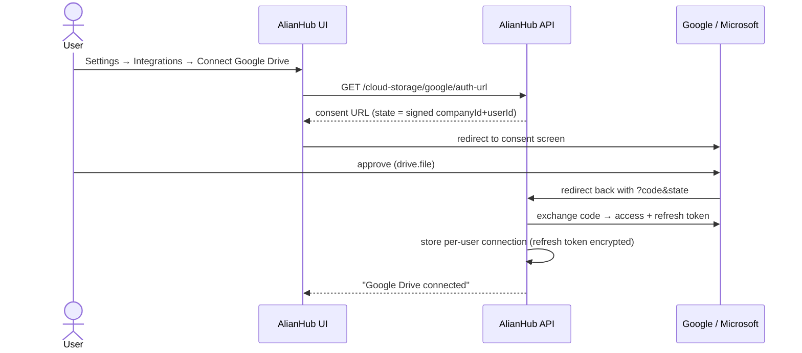
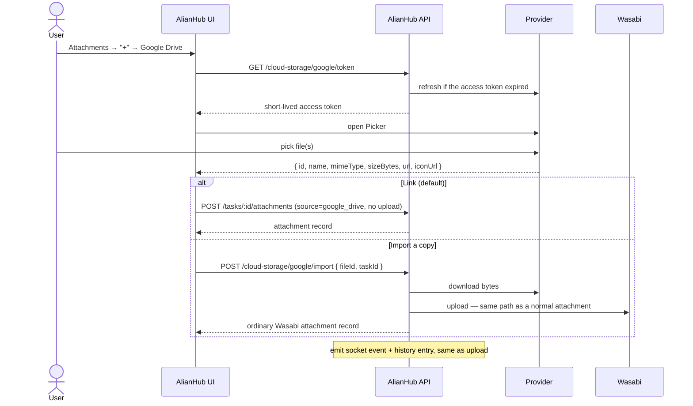

# Cloud attachments — Google Drive / Dropbox

**Task:** AHE-3838 · **Status:** ✅ built (local branch `feat/cloud-storage-attachments`, 4 commits, unpushed)

> **Both modes shipped.** Link is the default; "Import a copy" is a checkbox on
> the same menu. See §10 for what you must register before it can be tested.

> **OneDrive was removed** (2026-08-03). It was implemented but could never be
> verified: registering an Entra app now requires a directory, and a personal
> Microsoft account has none — the only routes to one are an Azure sign-up that
> demands a payment method or the M365 Developer Program. Rather than ship a
> provider nobody had ever run, the code was deleted outright. Adding it back
> means a new entry in `Modules/CloudStorage/helpers/cloudProviders.js`
> (auth/token URLs, `Files.Read offline_access` scope, Graph download +
> `/thumbnails` endpoints) and an `openOneDrivePicker` in `cloudPicker.js`; the
> generic settings, OAuth, link, preview and import plumbing all already handle
> an extra provider without change.

Goal: alongside "upload a file", let a user attach a file that already lives in
their Google Drive or Dropbox — the way ClickUp does it.

---

## 1. What we have today

Uploading a task/project attachment does this:

```
user picks file → POST /storage/upload (multipart) → Wasabi (or local disk)
              → attachment record pushed onto task.attachments[]
```

The record ([ProjectDetail.vue:194](../frontend/src/views/Projects/ProjectDetail/ProjectDetail.vue#L194)):

```js
{ filename, extension, size, id, createdAt, userId, type, url }
```

Two facts that make this feature cheap:

- **`attachments` is a free-form array** (`utils/mongo-handler/schema.js:103` —
  `type: Array`, no sub-schema). Array elements are Mixed, so new keys persist
  without a schema change. This is *not* the `strict: true` trap that hid
  `mainChat` — that only bites top-level declared paths.
- **An integrations registry already exists** — `integration_connections` +
  a catalog in [integrationsRules.js](../Modules/Integrations/helpers/integrationsRules.js),
  already carrying an `oauth: true` concept for Google Calendar. Cloud storage
  providers are three more catalog entries, not a new subsystem.

---

## 2. The one decision that shapes everything: **link** or **import**

This is the fork in the road. Everything else follows from it.

| | **Link** (ClickUp's default) | **Import** (copy) |
|---|---|---|
| What we store | a reference: file id + web link + name | the actual bytes, in Wasabi |
| Wasabi cost | none | same as a normal upload |
| Opening it | opens in Drive/Dropbox | opens in our existing previewer |
| Stays in sync | yes — edits in Drive are live | no, frozen at attach time |
| **Teammates can see it** | **only if the cloud file is shared with them** | always |
| If the owner deletes it in Drive | attachment breaks | unaffected |
| Effort | low | low-ish (one extra download step) |

**The permission catch is the important one.** If Parth attaches a Drive file
that's private to him, a teammate clicking it gets Google's "You need access"
screen. ClickUp lives with this and shows the file as a link with a Drive icon.
There is no way around it in link mode — we do not own the file's ACL.

**Recommendation: build link mode first, and add an "Import a copy" option on the
same picker.** Link is what people expect from the ClickUp comparison and it's
the cheaper half; import is a small addition on top and is the escape hatch when
sharing is a problem.

---

## 3. Don't build a file browser — use the vendors' pickers

Each provider ships a drop-in JS picker widget. We open it, the user picks, we
get metadata back. We never list folders, never proxy their API for browsing.

| Provider | Widget | Auth needed to pick |
|---|---|---|
| **Dropbox** | Dropbox Chooser (drop-ins) | **just an app key** — no OAuth, no token storage |
| **Google Drive** | Google Picker API | OAuth token, `drive.file` scope only |

**Start with Dropbox.** The Chooser needs only a public app key, returns a direct
link, and requires no token storage or refresh logic at all — so it proves the
whole attachment path end to end with none of the OAuth work. Google reuses that
same path and only adds the auth piece.

`drive.file` scope matters: it grants access **only to files the user explicitly
picked**, not their whole Drive. It's the narrow scope and the easy one to get
through Google's verification.

---

## 4. Flow — connecting an account (once per user)



**Auth is per USER, not per company.** Each person has their own Drive. This is
the one place the existing `integration_connections` shape doesn't fit as-is —
it's company-scoped for things like Slack. A cloud connection needs
`(companyId, userId, provider)` as its identity.

App credentials live in that same per-user row, so the identity of both the
credentials and the grant is `(companyId, userId, provider)`. Nothing about this
feature is company-wide.

---

## 5. Flow — attaching a file



Everything after "attachment record" is the existing path — the socket emit, the
history entry, the cache clear. That's deliberate: cloud attachments should be
just another row, not a parallel feature.

---

## 6. What we store

Link mode adds keys to the existing record and leaves `url` empty:

```js
{
  filename: "Q3 plan.xlsx",
  extension: "xlsx",
  size: 24576,
  id: "<makeUniqueId(17)>",
  createdAt, userId,
  type: "application",

  source: "google_drive",        // "dropbox" | absent = our own upload
  externalId: "1AbC…",           // provider file id
  externalUrl: "https://docs.google.com/…",   // where clicking it goes
  externalIcon: "https://…/xlsx.png",         // provider's icon
  externalOwner: "parth@…"       // whose account it came from
}
```

Import mode writes a **completely normal** record — no `source` key at all. Once
imported there's nothing cloud about it.

Reading side: `source` absent → today's behaviour, unchanged. That's what keeps
this from touching the existing flow.

---

## 7. UI touch points

- **[Attachments.vue](../frontend/src/components/atom/Attachments/Attachments.vue)** —
  the `+` is currently a bare `<label for="UploadedFile">` wrapping a file input.
  Becomes a small menu: *Upload from computer* / *Google Drive* / *Dropbox*.
  Only configured providers listed.
- **[AttachmentImage.vue](../frontend/src/components/atom/Attachments/AttachmentImage.vue)** —
  show the provider badge on the tile when `source` is set.
- **Click behaviour** — `source` set → open `externalUrl` in a new tab; no
  `source` → existing `ImagesPreviewer`. Linked files can't go in the previewer,
  we don't have their bytes.
- **Download All** — currently zips Wasabi files. Linked files must be **skipped
  with a note**, not silently dropped.
- **Settings → Integrations** — a "Cloud storage for attachments" section:
  workspace credentials (owner/admin only) plus a per-user Connect / Disconnect,
  and the redirect URI to copy.

---

## 8. Things that will bite

1. **Teammate can't open a linked file.** Section 2. Needs a product answer, not
   a code fix.
2. **Access tokens expire (~1h).** Refresh tokens must be stored encrypted and
   refreshed server-side. Never let a refresh token reach the browser.
3. **Revoked access.** User removes our app in Google → every linked attachment
   from that account breaks. Needs a clear "reconnect" state, not a stack trace.
4. **`state` on the OAuth callback must be signed.** The callback is a public
   endpoint; an unsigned `companyId/userId` in the query string lets someone bind
   a connection onto another user.
5. **Import respects nothing today.** A 5 GB Drive file would stream straight
   into Wasabi. Import needs the same size cap as normal uploads.
6. **Localhost.** Wasabi doesn't work locally, so **import mode can't be tested
   on localhost** — only link mode. Import verification has to happen on staging.
7. **OAuth redirect URIs are per-environment.** localhost, staging and prod each
   need registering in the provider consoles.

---

## 9. Suggested order

| # | Step | Commit |
|---|---|---|
| 1 | Attachment record supports `source` + provider badge + click-through | `a564c5b` |
| 2–5 | Per-user OAuth + picker tokens (backend) | `081575e` |
| 2–5 | All three pickers + link mode wired end to end | `d2c3c01` |
| 6 | "Import a copy" | `5371f1e` |
| — | moved config from the marketplace to Settings → Integrations | `ed66cd5` |

Built on `feat/cloud-storage-attachments`, nothing pushed.

### Files

**New** — `Modules/CloudStorage/` (`controller.js`, `routes.js`, `init.js`,
`helpers/cloudProviders.js`, `helpers/cloudStorageRules.js`,
`helpers/cloudCrypto.js`); `frontend/src/utils/cloudAttachment.js`;
`frontend/src/composable/cloudPicker.js`; three brand SVGs.

**Modified** — `Attachments.vue`, `AttachmentImage.vue`, `styleAttachment.css`,
`FileAndLinks.vue`, `TaskDetailTab.vue`, `ProjectDetail.vue`,
`Settings/Integrations/Integrations.vue`, `en.js`, `config/env.js`, `index.js`,
`setMiddleware.js`, and the five collection-registration points
(`collections.js`, `schemaType.js`, `schema.js`, `createSchema.js`,
`mongoQueries.js`). `integrationsRules.js` carries only a comment explaining why
the cloud providers are absent from that catalog.

### Why existing behaviour is unaffected

- `source` absent is the only marker of an ordinary upload, and every read path
  branches on `isCloudAttachment()` first, so existing records take exactly the
  code path they took before.
- The source menu is only rendered when at least one provider is configured. With
  none, `+` is the same `<label>` + file input it always was.
- No existing route, collection or document shape changed. `attachments` is a
  free-form `type: Array`, so the new keys need no schema change.
- One latent bug fixed in passing: `AttachmentImage` read
  `props.data.url.includes('http')` unguarded, which throws on any record without
  a `url`.

---

## 10. Setup required before this can be tested

Nothing appears in the UI until a provider is configured — by design, so an
instance that never sets one up keeps the original single-click `+`.

**Where:** `/<cid>/settings/integrations` → **Settings → Integrations**, in the
new **"Cloud storage for attachments"** section below the webhooks list.

**Entirely optional.** Nothing about the existing upload flow changes, and the
section can be ignored forever. Uploading from your computer keeps working
exactly as it does today.

> Not the Integrations & Automation Hub at `/<cid>/integrations` — the cloud
> providers were deliberately removed from that marketplace so there is one place
> to configure them, not two. (That hub also has no navigation link anywhere in
> the app, so it is only reachable by typing the URL.)

**Everything is per user, and private to them.** Each person enters their own app
credentials and connects their own account. No role restrictions, and no shared
state: one member never sees, edits or breaks another's setup, and two people can
link the same drive account independently.

That is a correction of an earlier revision which kept the credentials in
`integration_connections`, shared per workspace. The symptom: a fresh member
opened Settings and found the owner's saved credentials already filled in, and
could edit or delete them for everybody. For an optional attachment source on a
self-hosted app that is simply the wrong model.

So the credentials now live in the SAME row as the grant —
`cloud_storage_connections`, keyed `(userId, provider)` — and every read and write
is scoped to `req.uid`. Removing your credentials disconnects only you.

**Per provider, once per workspace:**

| Provider | Fields to fill | Where to get them |
|---|---|---|
| **Dropbox** | `app_key` | dropbox.com/developers → Create app → App key. **No OAuth needed** — start here. |
| **Google Drive** | `client_id`, `client_secret`, `api_key` | console.cloud.google.com → OAuth client (Web) + enable Picker API for the key |

**Redirect URI** — the settings section displays the exact value with a copy
button. Register it in the Google/Microsoft console, once per environment:

```
<APIURL>/api/v1/cloud-oauth/callback
```

So `http://localhost:4000/api/v1/cloud-oauth/callback` for local, and the staging
and production equivalents. A mismatch here is the single most common cause of a
consent screen erroring out.

**Editing later:** secret fields come back blank (they are never sent to the
browser) and a blank one means *keep the stored value*. So changing a client id
does not wipe the client secret.

**Optional env:**

| Var | Default | Purpose |
|---|---|---|
| `CLOUD_STORAGE_ENC_KEY` | falls back to `JWT_SECRET` | key for encrypting refresh tokens at rest |
| `CLOUD_STORAGE_MAX_IMPORT_BYTES` | `104857600` (100 MB) | import size cap |

**Then, per user:** open a task → Attachments `+` → click the provider → consent
once. Dropbox skips this step entirely.

---

## 11. What can be verified locally

Everything, including import — the local `.env` has working Wasabi credentials, so
"Import a copy" stores files locally exactly as it will on staging (confirmed
2026-08-03: an imported Drive file landed on a real Wasabi path with no `source`
key, indistinguishable from an upload).

| | localhost | staging |
|---|---|---|
| Dropbox link | ✅ | ✅ |
| Google Drive link | ✅ (register the localhost redirect URI) | ✅ |
| Import a copy | ✅ | ✅ |

Staging is still where the environment-specific wiring gets proven: the
CI-built frontend env vars, the production bucket, and each environment's own
redirect URI.

---

## Answers to the original open questions

1. **Link, import, or both?** → **Both.** Link is the default; import is a
   checkbox on the same menu, remembered per browser.
2. **Who registers the provider apps?** → Per workspace, via the existing
   Integrations settings page (§10). No AlianHub-owned shared credentials, which
   keeps self-hosted instances self-contained and means we hold no third-party
   client secrets on customers' behalf.
3. **All three now, or Dropbox first?** → All three are built, but Dropbox is the
   one to test first: app key only, no OAuth, no redirect-URI registration.
4. **Should a linked file count toward the storage quota?** → **No.** A link
   stores no bytes of ours, so `checkBucketStorage` is deliberately skipped for
   link mode and applied for import mode.
