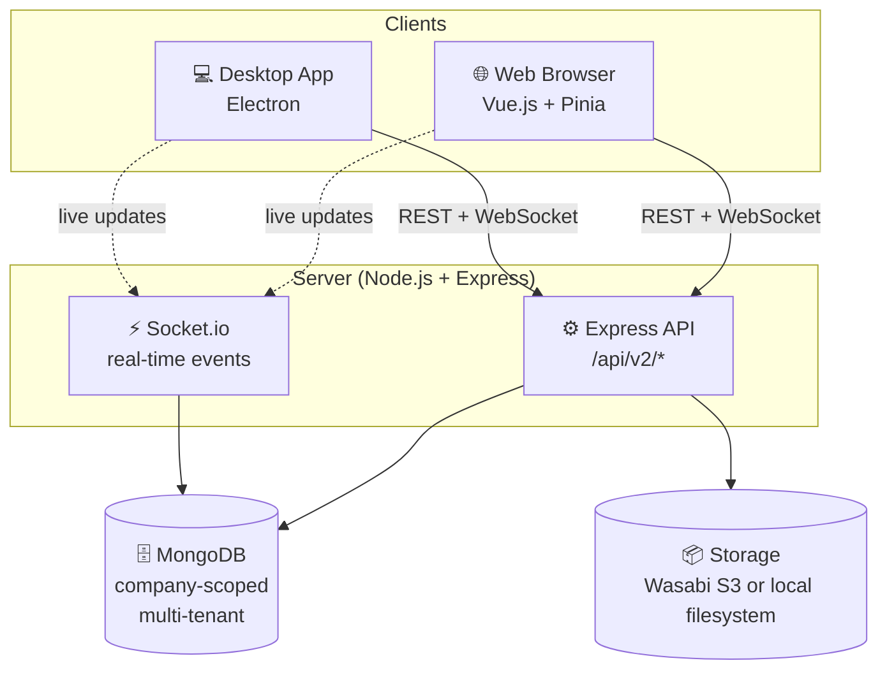

<div align="center">
<a href="https://alianhub.com">
    <strong style="font-size:32px;">AlianHub</strong>
</a>

<br/>
<br/>

<div align="center">
    <a href="https://alianhub.com">Website</a> |
    <a href="https://help.alianhub.com">Documentation</a> |
    <a href="./CONTRIBUTING.md">Contributing</a>
</div>
<br/>
<div>
    <a href="https://demo.alianhub.com" target="_blank">
      
    </a>
</div>
</div>

<br/>

<div align="center">
<strong>The open-source, self-hosted project management platform — a ClickUp / Jira alternative with built-in time tracking (screenshots + timesheets) and AI project planning.</strong>
<br/>
<br/>
Built for enterprises, startups, and growing teams — no per-seat pricing, no vendor lock-in, your data on your own servers.
</div>

<br/>

<div align="center">

[](LICENSE)
[](CODE_OF_CONDUCT.md)
[](https://github.com/aliansoftwareteam/AlianHub-Project-Management-System/releases)
[](https://github.com/aliansoftwareteam/AlianHub-Project-Management-System/discussions)
[](https://github.com/aliansoftwareteam/AlianHub-Project-Management-System/stargazers)

</div>

<br/>

<p align="center">
  <a href="https://demo.alianhub.com" target="_blank">
    
  </a>
</p>

<br/>

---

## Quick Start

### 🐳 Option 1 — Docker (recommended for self-hosting)

```bash
# Grab the compose file and run
curl -O https://raw.githubusercontent.com/aliansoftwareteam/AlianHub-Project-Management-System/main/docker-compose.yml
# Set JWT_SECRET (required) — see .env.example for full env-var reference
echo "JWT_SECRET=$(openssl rand -hex 32)" > .env
docker compose up -d
# AlianHub running at http://localhost:4000
```

Update to a newer version later:

```bash
docker compose pull && docker compose up -d
```

> Images are published to GHCR: `ghcr.io/aliansoftwareteam/alianhub:latest`. Multi-arch (amd64 + arm64).

### 🛠 Option 2 — From source (for developers)

```bash
git clone https://github.com/aliansoftwareteam/AlianHub-Project-Management-System.git
cd AlianHub-Project-Management-System
npm run setup
```

That's it. `npm run setup` will:

1. Install all dependencies (root, frontend, wizard) in parallel
2. Generate a `.env` file with secure random secrets
3. Build the installation wizard UI
4. Start the server (the same entry production uses)
5. Open `http://localhost:4000` in your browser

On a fresh system the server serves the **installation wizard**. Complete it
yourself — connect MongoDB, choose storage, skip or configure optional services
(Firebase / AI / SMTP), and create **your own** company and admin account.
Nothing is created automatically.

When it's done, you'll see this in your terminal:

```
────────────────────────────────────────────────────────────
  ✓  Server running — finish installation in your browser
────────────────────────────────────────────────────────────

  URL:   http://localhost:4000
  The wizard guides you to connect MongoDB, choose storage, and create
  your own company and admin account.
  When it finishes, the app rebuilds and the server stops (same as
  production). Run `npm start` again, then sign in.
  Stop:  Ctrl+C
────────────────────────────────────────────────────────────
```

The wizard's final step rebuilds the frontend and the server exits — the same
flow production relies on, where a process manager (e.g. pm2) restarts the app.
Locally there's no process manager, so just run **`npm start`** again, open
`http://localhost:4000`, and **log in with the account you created**.

**Prerequisite:** MongoDB running locally on `mongodb://localhost:27017`. If you don't have it: `docker run -d -p 27017:27017 mongo:7` or download from [mongodb.com](https://www.mongodb.com/try/download/community).

### Available commands

| Command | What it does |
|---------|--------------|
| `npm run setup` | Install deps, prepare `.env`, build the wizard UI, and start the server |
| `npm run dev` | Same as setup but skips dependency install |
| `npm run setup:reset` | Wipe `node_modules` and reinstall everything |
| `npm run setup -- --no-open` | Start without auto-opening a browser |

> All existing scripts (`npm start`, `npm run nodemon`, `npm run basic-install`) are unchanged. For active development with hot-reload, run the backend (`npm run nodemon`) and the frontend dev server (`cd frontend && npm run serve`) separately once the system is installed.

---

## What is AlianHub?

**AlianHub** is a full-stack, open-source project management system designed for teams that require flexibility, transparency, and ownership over their workflows.

Unlike SaaS-only tools, AlianHub is built to be:
- **Self-hosted**
- **Extensible**
- **Customizable for real-world organizational needs**

It supports both web and desktop environments and is suitable for internal tools, enterprise deployments, and long-term team collaboration.

---

## Architecture



> **Key principle:** all data is scoped to `companyId` for multi-tenancy. A single AlianHub instance can host multiple companies, each with isolated data.

Deeper architecture docs: [`.claude/ARCHITECTURE.md`](.claude/ARCHITECTURE.md) · [`.claude/DESIGN.md`](.claude/DESIGN.md)

---

## Tech Stack

AlianHub is built using a pragmatic and scalable stack:

- **Frontend**: Vue
- **Backend**: Node.js
- **Database**: MongoDB
- **Desktop**: Electron
- **Repository Structure**: Single repository

---

## Key Features

- **📋 Project & task management** — Create projects with custom milestones, sprints, statuses, and custom fields. Track tasks across **List, Board, Table, Calendar, and Workload** views with drag-and-drop, sub-tasks, checklists, attachments, comments, due dates, and reminders.

- **👥 Team collaboration with RBAC** — Assign tasks to users, manage role-based permissions per company, and create custom roles with dynamic permission rules. **Multi-tenant by design** — a single instance can host multiple companies, each with isolated data.

- **⚡ Real-time collaboration via Socket.io** — Changes propagate to every connected client instantly. No polling, no stale views, no `F5` refreshes.

- **🔍 Advanced search & saved filters** — Find tasks by project, status, assignee, creator, due date, or priority. Save frequently used filters for one-click reuse.

- **⏱️ Timesheets & reporting** — Project, user, and workload timesheets. Generate milestone and performance reports. Optional productivity tracking (screenshots / keystrokes / mouse events) for time-sensitive teams.

- **🤖 AI assistance** — Generate tasks, subtasks, checklists, descriptions, and project templates with AI. Multiple LLM providers supported.

- **💬 Built-in chat & channels** — Real-time messaging and dedicated channels per project or team.

- **💻 Web + desktop (Electron)** — Identical experience in the browser and as a native desktop app. **Multi-language UI** via vue-i18n.

- **🏠 Self-hosted, your data** — Run on your own servers with MongoDB and Wasabi/S3 (or local filesystem) storage. **No vendor lock-in, no per-seat pricing, no data leaving your infrastructure.**

> Features evolve continuously — see [Discussions](https://github.com/aliansoftwareteam/AlianHub-Project-Management-System/discussions) for what's next and [CHANGELOG.md](CHANGELOG.md) for what just shipped.

---

## Feature status

| Capability | Status |
|---|---|
| List · Board (Kanban) · Table · Calendar · Workload views | ✅ Shipped |
| Sub-tasks, checklists, attachments, comments, custom fields | ✅ Shipped |
| Time tracking — timesheets + optional screenshots / activity | ✅ Shipped |
| Custom roles & per-company RBAC | ✅ Shipped |
| Sprints, milestones & reports | ✅ Shipped |
| AI task / sub-task / project generation | ✅ Shipped |
| Built-in chat & channels · real-time sync (Socket.io) | ✅ Shipped |
| **Gantt / timeline view** | 🔜 On the roadmap |

## How AlianHub compares

Capabilities that are **free and built-in** here — but paid, limited, or absent in other open-source PM tools:

| Capability | AlianHub | Plane (open-source) |
|---|---|---|
| Time tracking with screenshots | ✅ Free | ❌ Not available |
| Custom fields | ✅ Free | 💲 Paid |
| Custom roles & permission matrix | ✅ Free | ❌ 3 fixed roles |
| Dashboards & widgets | ✅ Free | 💲 Paid (custom) |
| Built-in chat | ✅ Free | ❌ Not available |
| AI project generation | ✅ Free (your API key) | ❌ Not available |
| Milestones | ✅ Free | ❌ Not available |

> Comparison reflects each project's open-source edition; both are AGPL-3.0. AlianHub is younger and still closing gaps of its own (e.g. Gantt) — see the table above.

---

## 📸 Screenshots

A quick tour of AlianHub. [Try the live demo](https://demo.alianhub.com) to explore for yourself.

### Dashboard

<p align="center">
  <a href="https://demo.alianhub.com" target="_blank">
    
  </a>
</p>

<p align="center">
  <em>Customizable home dashboard with drag-to-arrange widgets — Task by Assignee, Workload by Status, and a live Calendar view.</em>
</p>

### Board View (Kanban)

<p align="center">
  <a href="https://demo.alianhub.com" target="_blank">
    
  </a>
</p>

<p align="center">
  <em>Drag-and-drop Kanban board grouped by status (or any field). Cards show due date, assignee, priority, and sub-task count. Switch the same project to <strong>List, Table, Calendar, Workload</strong>, or a custom view at any time.</em>
</p>

### List View

<p align="center">
  <a href="https://demo.alianhub.com" target="_blank">
    
  </a>
</p>

<p align="center">
  <em>Dense list view grouped by status with sortable columns — Chat, Assignee, Due Date, Priority, Key, Created Date, Created By. Select one or many tasks to bulk-edit status, priority, assignees, due dates, tags, or delete/archive in a single click.</em>
</p>

### Calendar View

<p align="center">
  <a href="https://demo.alianhub.com" target="_blank">
    
  </a>
</p>

<p align="center">
  <em>Monthly calendar with tasks rendered as color-coded bars spanning their start and due dates. Sub-tasks appear inline with their parent. Filter by yourself or any assignee, navigate month-to-month, or jump to today.</em>
</p>

### Task Detail

<p align="center">
  <a href="https://demo.alianhub.com" target="_blank">
    
  </a>
</p>

<p align="center">
  <em>Full task editor with <strong>Task Details, Comments, Activity Log, and Time Log</strong> tabs. Add sub-tasks, define unlimited custom fields (text, number, email, checkbox, currency, etc.), attach files, and track estimated vs. actual hours in the always-visible right sidebar.</em>
</p>

### Workload Report

<p align="center">
  <a href="https://demo.alianhub.com" target="_blank">
    
  </a>
</p>

<p align="center">
  <em>Weekly <strong>workload + timesheet</strong> in a single view — see logged vs. planned hours per user, drill down into projects and individual tasks, navigate any date range, and toggle between automatically tracked time and manual entries. A capacity-planning differentiator that most open-source PMS tools don't ship.</em>
</p>

### Settings & Customization

<p align="center">
  <a href="https://demo.alianhub.com" target="_blank">
    
  </a>
</p>

<p align="center">
  <em>Deep, per-company customization — company info, <strong>custom task priorities with icons</strong>, milestone statuses with past/future calendar visibility, multi-currency support, members & teams, project templates, custom field manager, role-based security &amp; permissions, time-tracking rules, and notification preferences.</em>
</p>

### AI Assist

<p align="center">
  <a href="https://demo.alianhub.com" target="_blank">
    
  </a>
</p>

<p align="center">
  <em>AI available everywhere — generate tasks, sub-tasks, checklists, project plans, and task descriptions from natural language. Pre-built prompt templates across <strong>Marketing, Sales, Email, SEO, and Services</strong> to jump-start your work without staring at a blank field.</em>
</p>

<!-- More screenshots added here as new modules are captured -->

---

## Documentation

📘 **Full user guide & API reference:** [help.alianhub.com](https://help.alianhub.com)

For development:

- 🤝 [CONTRIBUTING.md](CONTRIBUTING.md) — how to contribute
- 🌿 [BRANCHING.md](BRANCHING.md) — branching strategy and PR workflow
- 🛡️ [CODE_OF_CONDUCT.md](CODE_OF_CONDUCT.md) — community standards
- 🔒 [SECURITY.md](SECURITY.md) — responsible disclosure for security issues
- 🆘 [SUPPORT.md](SUPPORT.md) — where to ask questions, report bugs, request features

---

## Demo

You can explore a live demo here:

👉 **https://demo.alianhub.com**

> Demo data may reset periodically.

---

## Roadmap

What we're working on, what's planned, and what we're considering — follow along in [GitHub Discussions](https://github.com/aliansoftwareteam/AlianHub-Project-Management-System/discussions).

Want to suggest something? [Open a feature request](https://github.com/aliansoftwareteam/AlianHub-Project-Management-System/issues/new?template=feature_request.yml) or [start a discussion](https://github.com/aliansoftwareteam/AlianHub-Project-Management-System/discussions).

---

## Contributing

Contributions are welcome — bug reports, feature ideas, documentation fixes, and pull requests of all sizes.

📖 **Start here:**

- 🤝 [CONTRIBUTING.md](CONTRIBUTING.md) — how to submit issues and PRs
- 🌿 [BRANCHING.md](BRANCHING.md) — branch model and PR workflow
- 🛡️ [CODE_OF_CONDUCT.md](CODE_OF_CONDUCT.md) — community standards
- 🔒 [SECURITY.md](SECURITY.md) — responsible disclosure for security issues

Looking for something to work on? Browse [good first issues](https://github.com/aliansoftwareteam/AlianHub-Project-Management-System/issues?q=is%3Aissue+is%3Aopen+label%3A%22good+first+issue%22) or [help wanted](https://github.com/aliansoftwareteam/AlianHub-Project-Management-System/issues?q=is%3Aissue+is%3Aopen+label%3A%22help+wanted%22).

---

## Support & Community

| What | Where |
|---|---|
| 📘 **Read the docs** | [help.alianhub.com](https://help.alianhub.com) |
| 💬 **Ask a question** | [GitHub Discussions](https://github.com/aliansoftwareteam/AlianHub-Project-Management-System/discussions) |
| 🐛 **Report a bug** | [Bug Report issue](https://github.com/aliansoftwareteam/AlianHub-Project-Management-System/issues/new?template=bug_report.yml) |
| 🚀 **Request a feature** | [Feature Request issue](https://github.com/aliansoftwareteam/AlianHub-Project-Management-System/issues/new?template=feature_request.yml) |
| 🏢 **Commercial support** | [support@aliansoftware.net](mailto:support@aliansoftware.net) |

Full guide: [SUPPORT.md](SUPPORT.md).

---

## Deploy & customize with Aliansoftware

AlianHub is built and maintained by [Aliansoftware](https://aliansoftware.net). Want it run for you? We also **deploy, customize, and support** AlianHub for teams:

- 🚀 **Managed hosting & deployment** — on your infrastructure or ours
- 🛠️ **Custom features & integrations** — tailored to your workflow
- 🤝 **Priority support & response-time targets** — [support@aliansoftware.net](mailto:support@aliansoftware.net)

---

## Governance

AlianHub is currently maintained by **core maintainers (company-backed)**.

The long-term goal is to transition toward a **community-driven project with dedicated maintainers**.

---

## Security

If you discover a security vulnerability, **do not open a public issue**.

Please report it responsibly using GitHub Security Advisories as described in  
[`SECURITY.md`](SECURITY.md).

---

## Contributors ♥️ Thanks

We extend our gratitude to all our numerous contributors who create plugins, assist with issues and pull requests, and respond to questions on GitHub Discussions.

AlianHub Project-Management-System is a community-driven project, and your contributions continually improve it.

<br/>

<a href="https://github.com/aliansoftwareteam/AlianHub-Project-Management-System/graphs/contributors">
  
</a>

---

## Repo Activity

[](https://github.com/aliansoftwareteam/AlianHub-Project-Management-System/pulse)
[](https://github.com/aliansoftwareteam/AlianHub-Project-Management-System/commits)
[](https://github.com/aliansoftwareteam/AlianHub-Project-Management-System/pulls?q=is%3Apr+is%3Aclosed)
[](https://github.com/aliansoftwareteam/AlianHub-Project-Management-System/issues)

<!--
  To replace the badges above with a richer sparkline embed (like
  Plane's https://repobeats.axiom.co/api/embed/<hash>.svg), sign up
  at https://repobeats.axiom.co with this repo and paste the
  generated URL here.
-->

---

## License

Licensed under the **GNU Affero General Public License v3.0 (AGPL-3.0)**.

See the [LICENSE](LICENSE) file for the full license text and [COPYRIGHT](COPYRIGHT) for the copyright notice.

> **What AGPL-3.0 means for you:**
> - ✅ You can use, modify, self-host, and distribute AlianHub freely.
> - ✅ You can run a private modified version internally without publishing changes.
> - ⚠️ If you run a **modified** version as a **public network service** (SaaS), you must publish your modifications under the same license.
> - 📩 Need a different license for commercial / closed-source use? Contact us at [support@aliansoftware.net](mailto:support@aliansoftware.net).
